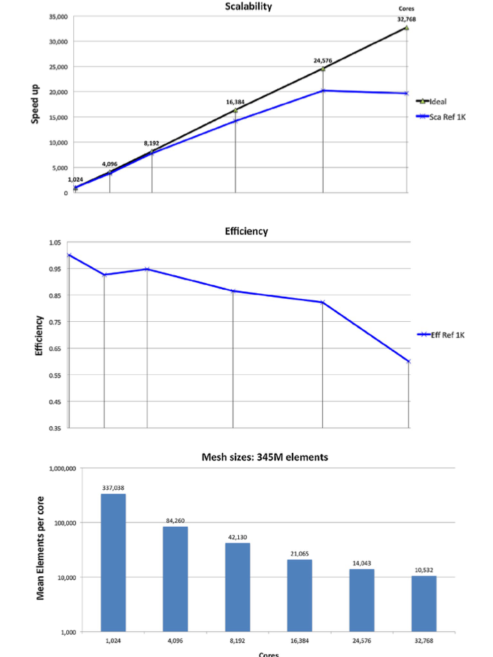
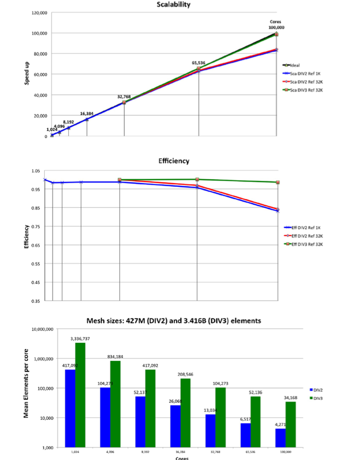

# Benchmarks and scalability on Blue Waters (NCSA) 

[Vasquez et al.](https://www.sciencedirect.com/science/article/abs/pii/S1877750315300521) measured Alya’s performance on the Blue Waters (NCSA) HPC system, for two different biomedical problems (incompressible flow in the respiratory system and non-linear solid mechanics coupled with electro-physiology of the human heart) with different mesh resolutions. 

 

Strong scalability and efficiency plot for a respiratory system problem. For details see [Vasquez et al.](https://www.sciencedirect.com/science/article/abs/pii/S1877750315300521)
 

The results show an almost linear scalability up to a hundred thousand cores for the problem with larger mesh size and excellent scalability, with a 0.8 efficiency maintained up to 30K and 60K cores for respiratory and cardiac problem respectively.  

 

*Strong scalability and efficiency plot for a respiratory system problem. For details see [Vasquez et al.](https://www.sciencedirect.com/science/article/abs/pii/S1877750315300521)*
 

For more information contact [software@compbiomed.eu](emailto:software@compbiomed.eu)

[Back](../..)