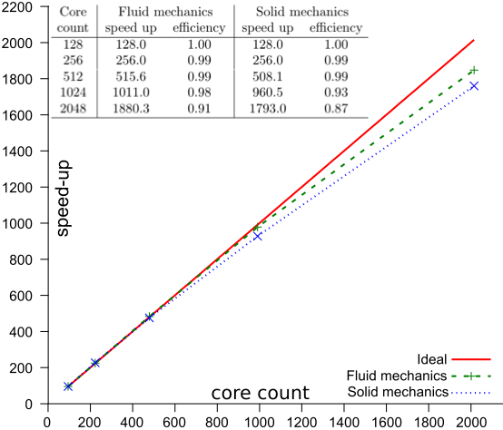

# Performance evaluation on Cartesius (SURFsara) 

Alya is available as module on the Cartesius system (SURFsara).
Here, Alya has been compiled by BSC and SURFsara personnel with different optimization flags until the maximum performance was obtained. After that a scalability test with a 100M (40M Solid, 60M Fluid) elements mesh was done. Finally, the bi-ventricular and full heart simulations where computed. 

 

 

Scalability of Alya on Cartesius system, for an uncoupled problem. Solid mesh: 40M elements. Fluid mesh: 60M elements.

The figure above shows the strong scaling analysis obtained on Cartesius (SURFsara). The results have been obtained by measuring the speed-up of the uncoupled fluid and solid mechanics simulations for an increasing number of processing elements. For optimised installation an efficiency above 87% was obtained for both models up to 2,000 cores. 

<!-- For more information on how to run Alya on Cartesius (SURFsara) look here. -->

--

[Back](../..)
