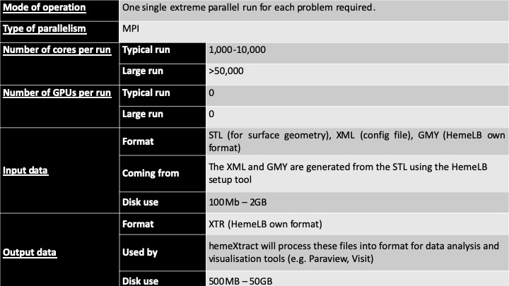

# HemeLB

**Provider :** [**University College London**](https://www.compbiomed.eu/about/partners/ucl/)

HemeLB developed by the team of Prof Peter Coveney at University College London (UCL), is a software pipeline that simulates blood flow in vessels in the human brain, in support of clinical neurosurgery. HemeLB is specifically designed to efficiently handle sparse topologies, supports real-time visualization and remote steering of the simulation and can handle fully resolved red blood cells. It runs on petascale platforms, alone and coupled to other codes. The pipeline takes as input an STL file of the surface geometry of the patient, generally obtained via segmentation of [DICOM images](https://www.dicomstandard.org/) from a CT-scan, and HemeLB, the parallel lattice-Boltzmann CFD solver, then simulates the fluid flow within that geometry, using the given velocity-time profiles for each inlet. Once complete, the simulation output is analysed using the hemeXtract utility, which can produce images of cross-sectional flow, or 3D shots of wall shear stress distribution in the geometry using ParaView visualisation software. 

For more information contact [software@compbiomed.eu](emailto:software@compbiomed.eu)

## Access the code

**Type:** Source code or Executable

HemeLB source code and documentation is available through the application website [www.hemelb.org](https://www.hemelb.org).
The UCL team also provide consulting to biomedical companies and clinical users for the use of the software.

## Technical specification and requirements

HemeLB is an open source massively parallel lattice-Boltzmann (LB) simulation framework. The main lattice-Boltzman solver is written in C++ and its parallelisation is implemented via MPI. The HemeLB application relies on several external libraries for tasks as XML processing, domain decomposition, unit testing, and real time visualisation.

* C and C++ compilers
* [Cmake](https://cmake.org/)
* MPI (>=3.0)
* Zlib
* [Boost](https://www.boost.org/)
* [METIS - Serial Graph Partitioning and Fill-reducing Matrix Ordering](http://glaros.dtc.umn.edu/gkhome/metis/metis/overview) 
* [ParMETIS](http://glaros.dtc.umn.edu/gkhome/metis/parmetis/overview)
* [TinyXML](https://sourceforge.net/projects/tinyxml/)
* [CPPUnit](https://sourceforge.net/projects/cppunit/)
* [CTemplate](http://goog-ctemplate.sourceforge.net/)

HemeLB is compatible with most versions of GCC and Intel compilers and most modern MPI implementations. TinyXML, ParMETIS, CPPUnit, CTemplate, Boost and Zlib are provided with HemeLB sources and can be built during the HemeLB build. 

## Running HemeLB

The HemeLB computational pipeline take as input an STL file of the surface geometry of the patient, usually obtained through segmentation of DICOM image files from CT-scans and uses the fully parallelised Palabos’ voxelizer to prepare the geometry for the LB solver. The approach is relatively rapid and with almost no user intervention needed. This is an advantage over traditional CFD methods, which rely on unstructured mesh generation procedures to obtain the discrete representation of the geometry; complex geometries tend to require high levels of user intervention and considerable CPU time to ensure mesh quality. The output of HemeLB can be analysed using the post-processing tool hemeXtract, which is distributed with the code. This utility produces images of different properties (i.e. cross-sectional flow or 3D image of the wall shear stress distribution) which can then be visualised with Paraview.

For more information on how to get access to a system to run the code check the [CompBioMed HPC allocations](https://www.compbiomed.eu/high-performance-computer-allocations/) service.

* [**UCL Tutorial**](http://hemelb.org.s3-website.eu-west-2.amazonaws.com/tutorials/): tutorial on how to install and run the code.

* [**Optimal installation on Cartesius**](cart_hemelb.md): instructions on how to compile the code on HPC systems.

## HemeLB on High Performance Computing systems

HemeLB is specifically designed to efficiently handle sparse topologies, supports real-time visualization and remote steering of the simulation and can handle fully resolved red blood cells. The code is highly scalable, already running on up to 200,000 cores on several multi-petaflop machines. The code has been installed and tested on ARCHER (EPCC, UEDIN), Cartesius (SURFsara), SuperMUC (LRZ), Prometheus (PSNC) and Blue Waters (NCSA), and it is a flagship code of the [UKCOMES](http://www.ukcomes.org/) project. HemeLB has undergone continuous development within the project, and CompBioMed Core Partner UCL has worked to improve performance (e.g. memory usage and load balance) and execution times for large systems with billions of lattice sites.

**HemeLB typical HPC usage within the CompBioMed community**

### Benchmarks and code performances

Alya has been tested by the BSC team, on a large number of Tier-0 and Tier-1 HPC systems. 

* [**HemeLB strong scaling analysis**](bench_hemelb1.md)

### Training material and presentations

Media and training material on HemeLB from the CompBioMed project.

* **Application Simple magnetic drug targeting simulations with HemeLB**   
[CompBioMed training at VPH2018 – High Performance for the VPH ](https://www.compbiomed.eu/events-2/high-performance-computing-for-the-vph/)

<iframe width="560" height="315" src="https://www.youtube.com/embed/aIedCumP6bw" frameborder="0" allow="accelerometer; autoplay; encrypted-media; gyroscope; picture-in-picture" allowfullscreen></iframe>

---

* **HemeLB – Simulation of cardiovascular flow on high performance computers**   
[CompBioMed webinar](https://www.compbiomed.eu/compbiomed-webinar-10)

<iframe width="560" height="315" src="https://www.youtube.com/embed/WFSMRml_gn4" frameborder="0" allow="accelerometer; autoplay; encrypted-media; gyroscope; picture-in-picture" allowfullscreen></iframe>

[Back](../..)
