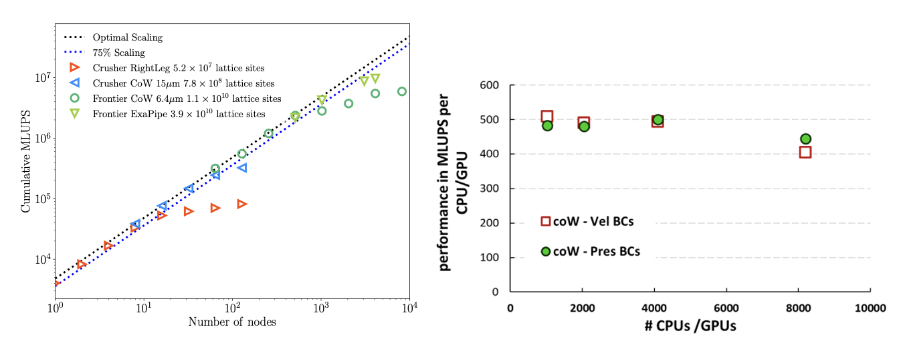

# HemeLB

**Provider :** [**University College London**](https://www.compbiomed.eu/about/partners/ucl/)

## Building HemeLB

Atos worked on a unified CMake build system allowing HemeLB to target at compile time either CUDA, HIP with CUDA backend or HIP with ROCm backend within a single code base. The master CUDA branch has diverged enough from the original HIP version that merging the two would have been difficult. It is partially to avoid this kind of issues that maintaining a single code base with a single build system for several GPU versions of HemeLB is preferrable. The CUDA master branch was then “re-hipified”.
 
This was tested on several Nvidia and AMD GPUs such as A100 and MI250. We have observed no performance overhead from the HIP-CUDA backend compared to the CUDA backend, which is expected as the translation from HIP to CUDA only occurs at compile time. The performance we obtained on MI250 is similar to what we get on A100, which may indicate room for improvement.

## HemeLB (CPU)

Within the CPU code, hybrid parallelism (OpenMP+MPI) has been implemented to investigate its ability to execute on larger core counts. On Fugaku, this implementation allowed us to conduct simulations on 480,000 CPU cores; however (and as expected), the scaling behaviour was not as good as in the pure MPI version. 

## HemeLB (GPU)

The GPU version of HemeLB has been used extensively on Frontier the world’s only exascale machine. In preparation for that, HemeLB was tested on the Crusher development platform. The studies conducted on these machines show the excellent scalability of HemeLB.

The figure below shows the strong scaling performance of HemeLB_GPU (with pressure boundary conditions) using different vascular models on both Frontier and Crusher. 

Three vascular models were tested: the right leg vascular model and the Circle of Willis (CoW) vascular model at resolutions of 15 μm and 6.4 μm, respectively. These models consist of lattice sites ranging from 5.2 x $10^{7}$ to 1.1 x $10^{10}$ and ran for 10,000 time-steps. To exploit the potential for exascale computing here, we have further tested pipe flow scaling with 3.9 x $10^{10}$ lattice sites. In the optimal scaling region, HemeLB_GPU demonstrates a single-node performance of approximately 4000 million lattice updates per second (MLUPS). This performance exhibits linear strong scaling with the number of nodes until degradation sets in due to the problem size. We have also demonstrated continued strong scaling behaviour on up to 87% of the full Frontier system (8192 AMD nodes). The plot also depicts both velocity and pressure BCs on the CoW domain. By minimizing the exchange of data between the host (CPU) and the device (GPU) at every time-step; all calculations regarding the BCs are now performed on the GPU. This results in a significant increase in performance for the Velocity BCs case, bringing it to a comparable level to the Pressure BCs case.

We have been making good progress towards porting the HemeLB_GPU CUDA code to Intel's oneAPI (SYCL/DPC++) through our access to various machines (CSD3 (Cambridge, UK), SuperMUC-NG Phase 2 (LRZ), Florentia and Sunspot (Argonne National Laboratory), the latter being the current production partition on Aurora). To this end, we used Intel's compatibility tool (dpct) which converts CUDA code into SYCL/DPC++ code. Porting of the full HemeLB_GPU code was carried out recently on SuperMUC-NG Phase 2 (LRZ) and Sunspot (ANL). Progress on the oneAPI DPC++/SYCL has proceeded on two fronts. One approach focused on using Intel's oneAPI conversion tool dpct (DPCT Version). The other approach was to convert the existing HIP kernels into C++ functors  (Functor Version) and to abstract the system specific (HIP/CUDA/SYCL) interfaces into a system independent one, which can be implemented individually for each programming model. To this end a SYCL back-end was constructed.  Ultimately some C++ undefined behaviour was identified in some of the kernels where a bit shift operator for generating a mask, was called with a negative shift. Fixing this issue allowed both SYCL implementations to run, including running both the DPCT version of the code and the Functor Version of the code on Sunspot, as well as the systems at LRZ in Garching, Germany. The Functor Version was developed on OLCF Frontier at Oak Ridge National Laboratory (ORNL) in the US, using the open-source Intel LLVM/Clang branch which is undergoing further development with Codeplay under contract with ORNL, supported by the Exascale Computing Project.

In summary, both the Functor and DPCT versions of the code have been run on Intel GPU hardware including on Sunspot. The “functorised” version of the code has also been run successfully on AMD GPU hardware. We also plan to run both versions of the code on NVIDIA GPU hardware and plan to report on the results in a performance-portability oriented paper.

Additional strong scaling studies were performed of both HemeLB-CPU and HemeLB-GPU on multiple partitions of Snellius (SURF) and LUMI (CSC) supercomputers. In the figure below we highlight the linear scaling behaviour of HemeLB-CPU when simulating the Circle of Willis “small” geometry (CoW15).

This geometry has approximately 770 million fluid sites. Simulations were carried out on the Snellius Rome, Genoa, and LUMI-C partitions. In this scaling study we were able to compare the Zen2, Zen3, and Zen4 Generations of the AMD EPYC processors next to each other. In these strong scaling tests, we underpopulated the core-complexes of each compute node using only half of the node cores. This allowed us to increase the available memory bandwidth per MPI process. Additionally, in the Snellius’ simulations, this led to more stable file read and communication operations.

The figure below depicts a similar strong scaling study in a larger geometry, the Circle of Willis “large” (CoW6) which has approximately 10 billion fluid sites. 

This strong scaling study was carried out with both the GPU and CPU version of HemeLB. We plot the CPU and GPU results side by side, by reporting the number of MPI ranks used in each simulation. For the GPU runs, 1 MPI rank was used per Graphics Compute Die (GCD) of the MI250x of the LUMI-G partition. This means that we used 8 processes per GPU node (4 GPUs per node) per LUMI-G node, with 2 processes per GPU. We observe about 97% linear scaling behaviour of HemeLB-GPU on LUMI-G up to 8190 MI250x GPUs, an impressive result. This is the maximum allowed in the “standard-g” partition of LUMI. The CPU counterpart of these simulations did not exhibit such good scaling behaviour as compared to the GPU runs. We attribute this to the fact that there are many more MPI Ranks per AMD processor compared to the GPU runs, which lead to a substantial communication overhead and competition with other communication  processes on the LUMI network.

Finally we present the benchmark results of HemeLB  over successive CPU/GPU generations (figure below).

Using millions of lattice site updates per second (MLUPS), we can get a normalized view of the performance of any Lattice Boltzmann code across any compute architecture and geometry size. MLUPS are calculated on a per-node and per-MPI-rank basis.

In the left panel  we observe that the older CPU processors exhibit higher performance per core than the newer AMD processors (Rome, Milan, Genoa). This is evident because the AMD EPYC processors have leveraged more logic cores per socket than older-generation processors. This leads to higher performance per compute node as shown in the right panel, which increases per AMD “Zen” generation. We chose to under-populate the core complexes of the AMD processors to increase the memory bandwidth per process available to HemeLB.

