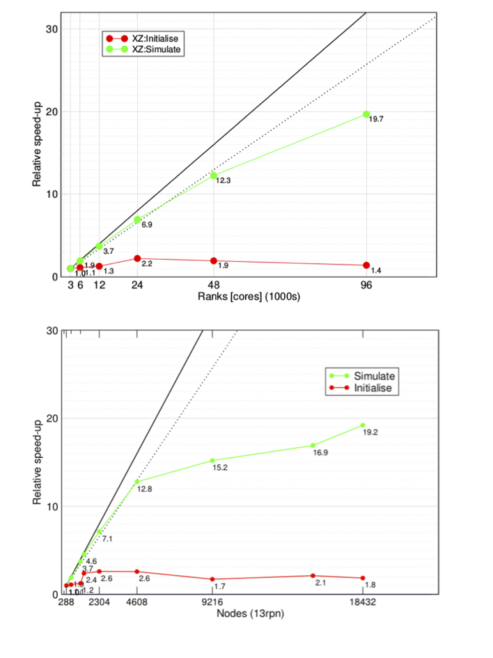

# HemeLB strong scaling analysis

Within a work in collaboration with the [PoP CoE](https://pop-coe.eu) and the EU funded project [Compat](https://www.compatproject.eu/) UCL has analysed the strong scaling behaviour of HemeLB for the simulation of a blood flow in the Circle of Willis cerebral arterial circle. The code has been tested on ARCHER and NCSA Blue Waters supercomputers, showing excellent performances up to hundreds of thousands of cores. 

<small>Strong scaling of HemeLB up to 96,000 cores on EPCC ARCHER (top) and up to 239,615 cores on NCSA Blue Waters (bottom). The plots show both initialisation (red line) and simulate phase (green line). Two different initial data datasets of 7.7 x 108 and 1.5x109 lattice sites on ARCHER and Blue Waters, respectively.</small>

The Figure above contains the results on studies performed on the two systems: HemeLB, on ARCHER (EPCC, UEDIN) (top panel), showed excellent scalability, with about 20-fold speed-up at 96,000 cores and 80 % parallel efficiency up to 48,000 cores with respect to the reference configuration run on the system (3,000 cores). On Blue Waters (NCSA) (bottom panel), scalability has been investigated from 288 up to 18,432 compute nodes. In order to fit within the memory per node on the system, only 13 of the 16 cores available per node have been used, for a total of about 240,000 MPI ranks per single simulation. The results for the simulation phase, show an 80% efficiency and speed up by a factor of 13 with 59,904 cores compared to the used baseline for this system (3744 cores). A maximum relative speed up of 19.2 was achieved with 239,615, but in this case efficiency was much lower. For this work the authors have collaborated with [SCALASCA](https://www.scalasca.org/) developers in order to use this profiling tool at core counts over 30,000. The study, has been useful to identify bottlenecks in the use of current MPI-2 and MPI-3 implementations which, using only 32-bit communications, are inadequate when running on hundreds of thousands of cores. For this reason, HemeLB has become a “use case” for the MPI Forum in the release of MPI-4, which contains clean 64-bit communications.

UCL is currently working on coupled full human blood flow simulation which is planned to run on SuperMUC-NG (LRZ) using up to 160,000 cores which will provide a new insight into the scalability of the code, towards exascale machine. 
